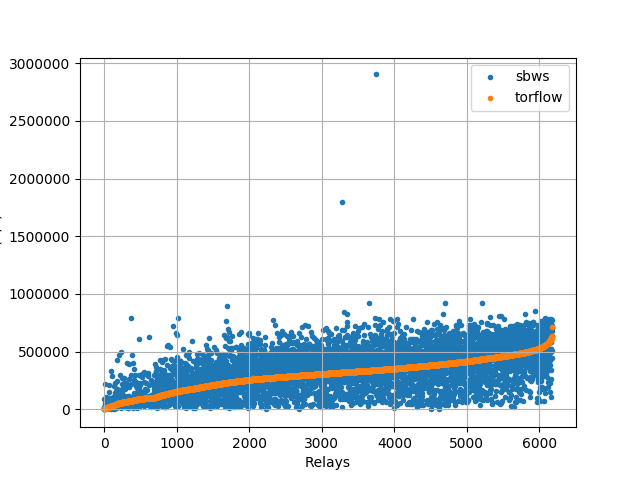
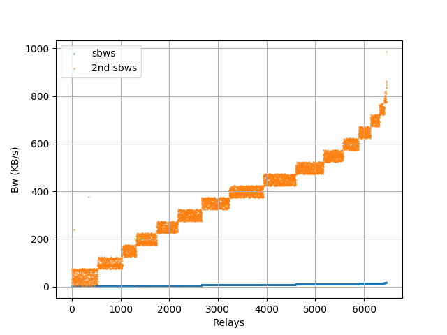
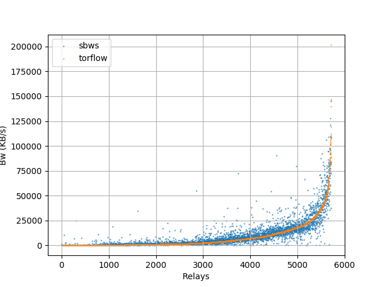

Relays' bandwidth distribution
===================================

sbws raw measurements compared to Torflow measurements
------------------------------------------------------

.. image:: images/43710933-ac95e0bc-9960-11e8-9aaf-0bb1f83b65e2.png
   :alt: sbws and torflow raw measurements distribution 2

sbws linear scaling
--------------------

Multiply each relay bandwidth by ``7500/median``

See bandwidth_file_spec_ appendix B to know how about linear scaling.

Code: :func:`sbws.lib.v3bwfile.sbws_scale`

sbws Torflow scaling
-----------------------

See bandwidth_file_spec_ appendix B to know how about torflow scaling.

Code: :func:`sbws.lib.v3bwfile.torflow_scale`

.. _bandwidth_file_spec: https://gitweb.torproject.org/torspec.git/tree/bandwidth-file-spec.txt
