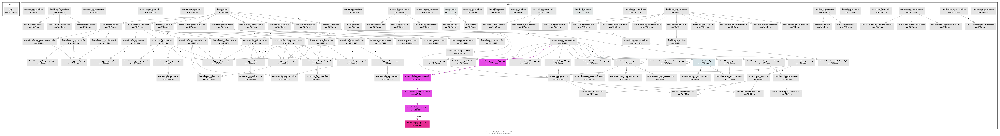

Code design
=================

.. todo::
   - Link to refactor proposal.
   - Change this page when refactoring is implemented.

UML classes diagram
--------------------

.. image:: images/classes_original.*
   :alt: UML classes diagram

`classes_original.svg <./_images/classes_original.svg>`_

Packages diagram
-----------------

.. image:: ./images/packages_sbws.*
   :alt: packages diagram

`packages_sbws.svg <./_images/packages_sbws.svg>`_

scanner threads
----------------

- `TorEventListener`: the thread that runs Tor and listens for events.
- ResultDump: the thread that get the measurement results from a queue
  every second.
- `multiprocessing.ThreadPool` starts 3 independent threads:
  - workers_thread
  - tasks_thread
  - results_thread
- measurement threads: they execute :func:`sbws.core.scanner.measure_relay`
  There'll be a maximum of 3 by default.

.. image:: images/threads.*
   :alt: scanner threads

Critical sections
-----------------

Data types that are read or wrote from the threads.

.. image:: images/critical_sections.*
   :alt: scanner critical sections
   :height: 400px
   :align: center

Call graph
--------------

Initialization calls to the moment where the measurement threads start.

`callgraph.png <./_images/pycallgraph.png>`_
