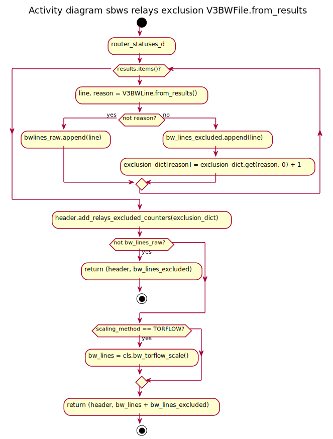
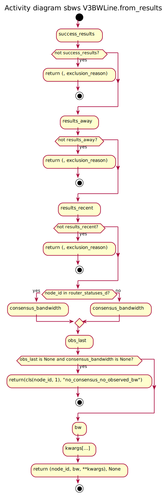
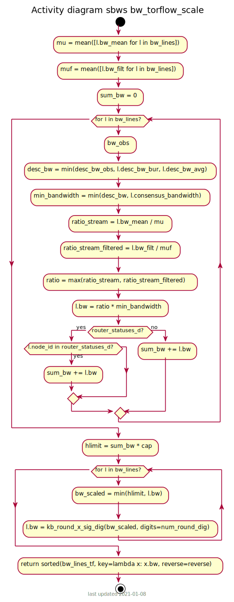

.. _generator:

How aggregation and scaling works
=================================

.. seealso:: :ref:`scanner` (scanner part).

Every hour, the generator:

#. Aggregate all the measurements (not older than 6 six days) for every relay.
#. Filter the measurements
#. Scale the measurements
#. Write the bandwidth file

Source code: :func:`sbws.lib.v3bwfile.V3BWFile.from_results`

.. _filtering-measurements:

Filtering the bandwidth measurements
-------------------------------------

Each relay bandwidth measurements are selected in the following way:

#. At least two bandwidth measurements (``Result`` s) MUST have been obtained
   within an arbitrary number of seconds (currently one day).
   If they are not, the relay MUST NOT be included in the Bandwith File.
#. The measurements than are are older than an arbitrary number of senconds
   in the past MUST be discarded.
   Currently this number is the same as ``data_period`` (5 days) when not
   scaling as Torflow and 28 days when scaling as Torflow.

If the number of relays to include in the Bandwidth File are less than
a percententage (currently 60%) than the number of relays in the consensus,
additional Header Lines MUST be added (see XXX) to the Bandwith File and the
relays SHOULD NOT be included.

.. _scaling-the-bandwidth-measurements:

Scaling the bandwidth measurements
------------------------------------

Consensus bandwidth obtained by new implementations MUST be comparable to the
consensus bandwidth, therefore they MUST implement torflow_scaling_.

The bandwidth_file_spec_ appendix B describes torflow scaling and a linear
scaling method.

.. seealso:: :ref:`torflow_aggr` and :ref:`differences`.

Writing the bandwidth file
---------------------------

The bandwidth file format is defined in the bandwidth_file_spec_.

.. _torflow_scaling: https://gitweb.torproject.org/torflow.git/tree/NetworkScanners/BwAuthority/README.spec.txt#n298
.. _bandwidth_file_spec: https://gitweb.torproject.org/torspec.git/tree/bandwidth-file-spec.txt
