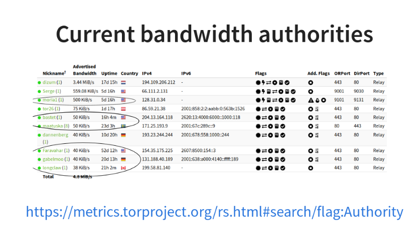
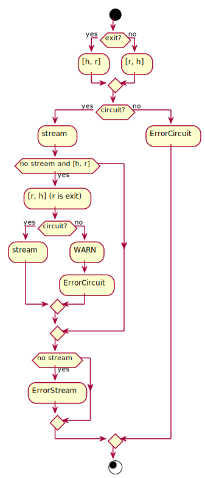

.. _scanner:

How sbws works
==============

Overview
---------

.. The following text is part of the introduction in the README, but rst
   formatted.

The :term:`scanner` measures the bandwidth of each relay in the Tor network
(except the directory authorities) by creating a two hops circuit
with the relay. It then measures the bandwidth by downloading data
from a :term:`destination` Web Server and stores the measurements.

The :term:`generator` read the measurements, aggregates, filters and
scales them using torflow's scaling method.

Then it generates a :term:`bandwidth list file` that is read
by a :term:`directory authority` to report relays’ bandwidth in its vote.

.. image:: ./images/scanner.svg
   :height: 200px
   :align: center

Intialization
--------------

.. At some point it should be able to get environment variables

#. Parse the command line arguments and configuration files.
#. Launch a Tor thread with an specific configuration or connect to a running
   Tor daemon that is running with a suitable configuration.
#. Obtain the list of relays in the Tor network from the Tor consensus and
   descriptor documents.
#. Read and parse the old bandwidth measurements stored in the file system.
#. Select a subset of the relays to be measured next, ordered by:

   #. relays not measured.
   #. measurements age.

.. image:: ./images/use_cases_data_sources.svg
   :alt: data sources
   :height: 200px
   :align: center

Classes used in the initialization:

.. image:: ./images/use_cases_classes.svg
   :alt: classes initializing data
   :height: 300px
   :align: center

Source code: :func:`sbws.core.scanner.run_speedtest`

Measuring relays
-----------------

#. For every relay:
#. Select a second relay to build a Tor circuit.
#. Build the circuit.
#. Make HTTPS GET requests to the Web server over the circuit.
#. Store the time the request took and the amount of bytes requested.

.. image:: ./images/activity_all.svg
   :alt: activity measuring relays
   :height: 300px
   :align: center

Source code: :func:`sbws.core.scanner.measure_relay`

Measuring a relay
~~~~~~~~~~~~~~~~~

Source code: :func:`sbws.core.scanner.measure_relay`

Selecting a second relay
------------------------

#. If the relay to measure is an exit, use it as an exit and obtain the
   non-exits.
#. If the relay to measure is not an exit, use it as first hop and obtain
   the exits.
#. From non-exits or exits, select one randomly from the ones that have
   double consensus bandwidth than the relay to measure.
#. If there are no relays that satisfy this, lower the required bandwidth.

.. image:: ./images/activity_second_relay.svg
   :alt: activity select second relay
   :height: 400px
   :align: center

Source code: :func:`sbws.core.scanner.measure_relay`

Selecting the data to download
-------------------------------

#. While the downloaded data is smaller than 1GB or the number of download
   is minor than 5:
#. Randomly, select a 16MiB range.
#. If it takes less than 5 seconds, select a bigger range and don't keep any
   information.
#. If it takes more than 10 seconds, select an smaller range and don't keep any
   information.
#. Store the number of bytes downloaded and the time it took.

Source code: :func:`sbws.core.scanner._should_keep_result`

Writing the measurements to the filesystem
-------------------------------------------

For every measured relay, the measurement result is put in a queue.
There's an independent thread getting measurements from the queue every second.
Every new measurement is appended to a file as a json line
(but the file itself is not json!).
The file is named with the current date. Every day a new file is created.

Source code: :func:`sbws.lib.resultdump.ResultDump.enter`

.. seealso:: :ref:`generator`.

.. _torflow: https://gitweb.torproject.org/torflow.git
.. _stem: https://stem.torproject.org
.. https://github.com/requests/requests/issues/4885
.. _requests: http://docs.python-requests.org/
.. _peerflow: https://www.nrl.navy.mil/itd/chacs/sites/www.nrl.navy.mil.itd.chacs/files/pdfs/16-1231-4353.pdf
