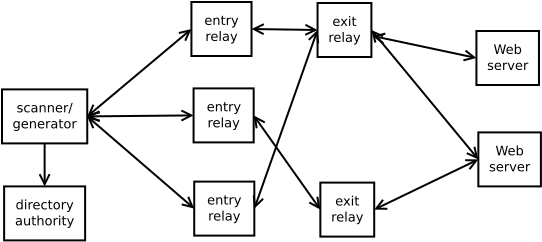
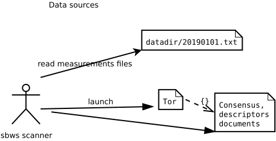
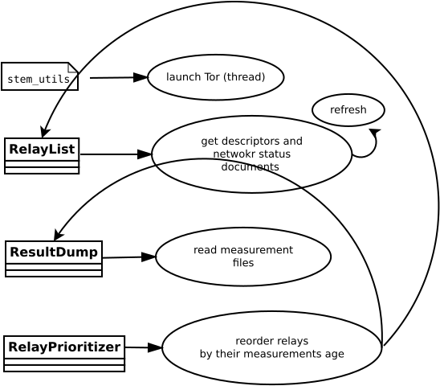
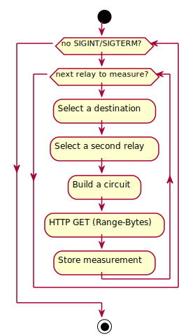
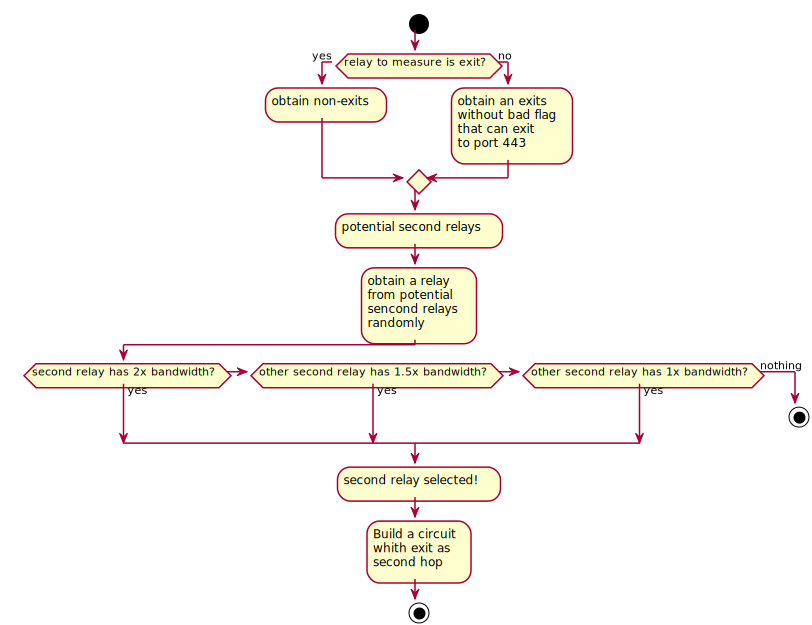

What the scanner and the generator do
======================================

Running the scanner
-----------------------

Overview
~~~~~~~~~

The :term:`scanner` obtain a list of relays from the Tor network.
It measures the bandwidth of each relay by creating a two hop circuit with the
relay to measure and download data from a :term:`destination` Web Server.
The :term:`generator` creates a :term:`bandwidth list file` that is read
by a :term:`directory authority` and used to report relays' bandwidth in its
vote.

Intialization
~~~~~~~~~~~~~~

.. At some point it should be able to get environment variables

#. Parse the command line arguments and configuration files.
#. Launch a Tor thread with an specific configuration or connect to a running
   Tor daemon that is running with a suitable configuration.
#. Obtain the list of relays in the Tor network from the Tor consensus and
   descriptor documents.
#. Read and parse the old bandwidth measurements stored in the file system.
#. Select a subset of the relays to be measured next, ordered by:

   #. relays not measured.
   #. measurements age.

Classes used in the initialization:

Source code: :func:`sbws.core.scanner.run_speedtest`

Measuring relays
~~~~~~~~~~~~~~~~~

#. For every relay:
#. Select a second relay to build a Tor circuit.
#. Build the circuit.
#. Make HTTPS GET requests to the Web server over the circuit.
#. Store the time the request took and the amount of bytes requested.

Source code: :func:`sbws.core.scanner.measure_relay`

Selecting a second relay
~~~~~~~~~~~~~~~~~~~~~~~~

#. If the relay to measure is an exit, use it as an exit and obtain the
   non-exits.
#. If the relay to measure is not an exit, use it as first hop and obtain
   the exits.
#. From non-exits or exits, select one randomly from the ones that have
   double consensus bandwidth than the relay to measure.
#. If there are no relays that satisfy this, lower the required bandwidth.

Source code: :func:`sbws.core.scanner.measure_relay`

Selecting the data to download
~~~~~~~~~~~~~~~~~~~~~~~~~~~~~~~

#. While the downloaded data is smaller than 1GB or the number of download
   is minor than 5:
#. Randomly, select a 16MiB range.
#. If it takes less than 5 seconds, select a bigger range and don't keep any
   information.
#. If it takes more than 10 seconds, select an smaller range and don't keep any
   information.
#. Store the number of bytes downloaded and the time it took.

Source code: :func:`sbws.core.scanner._should_keep_result`

Writing the measurements to the filesystem
~~~~~~~~~~~~~~~~~~~~~~~~~~~~~~~~~~~~~~~~~~~

For every measured relay, the measurement result is put in a queue.
There's an independent thread getting measurements from the queue every second.
Every new measurement is appended to a file as a json line
(but the file itself is not json!).
The file is named with the current date. Every day a new file is created.

Source code: :func:`sbws.lib.resultdump.ResultDump.enter`

Running the generator
-----------------------

Every hour, the generator:
#. Aggregate all the measurements (not older than 6 six days) for every relay.
#. Filter the measurements
#. Scale the measurements
#. Write the bandwidth file

Source code: :func:`sbws.lib.v3bwfile.V3BWFile.from_results`

Filtering the bandwidth measurements
~~~~~~~~~~~~~~~~~~~~~~~~~~~~~~~~~~~~~

Each relay bandwidth measurements are selected in the following way:

#. At least two bandwidth measurements (``Result`` s) MUST have been obtained
   within an arbitrary number of seconds (currently one day).
   If they are not, the relay MUST NOT be included in the Bandwith File.
#. The measurements than are are older than an arbitrary number of senconds
   in the past MUST be discarded.
   Currently this number is the same as ``data_period`` (5 days).

If the number of relays to include in the Bandwidth File are less than
a percententage (currently 60%) than the number of relays in the consensus,
additional Header Lines MUST be added (see XXX) to the Bandwith File and the
relays SHOULD NOT be included.

Scaling the bandwidth measurements
~~~~~~~~~~~~~~~~~~~~~~~~~~~~~~~~~~~~

Consensus bandwidth obtained by new implementations MUST be comparable to the
consensus bandwidth, therefore they MUST implement torflow_scaling_.
The bandwidth_file_spec_ appendix B describes torflow scaling and a linear
scaling method.

Writing the bandwidth file
~~~~~~~~~~~~~~~~~~~~~~~~~~~

The bandwidth file format is defined in the bandwidth_file_spec_.

.. _torflow: https://gitweb.torproject.org/torflow.git
.. _stem: https://stem.torproject.org
.. https://github.com/requests/requests/issues/4885
.. _requests: http://docs.python-requests.org/
.. _peerflow: https://www.nrl.navy.mil/itd/chacs/sites/www.nrl.navy.mil.itd.chacs/files/pdfs/16-1231-4353.pdf
.. _torflow_scaling: https://gitweb.torproject.org/torflow.git/tree/NetworkScanners/BwAuthority/README.spec.txt#n298
.. _bandwidth_file_spec: https://gitweb.torproject.org/torspec.git/tree/bandwidth-file-spec.txt