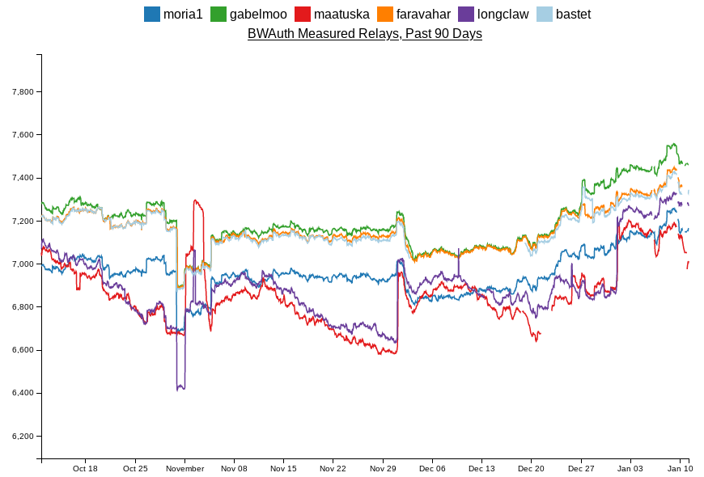

Monitoring bandwidth changes in the Tor Network
================================================

Bandwidth authorities timeline
------------------------------

Events that can affect the data generated by the bwauths:

https://gitlab.torproject.org/tpo/network-health/sbws/-/wikis/bandwidth%20authorities%20timeline

This page might be moved to a different location.

Bwauths number of measured relays
---------------------------------

It should be approximately equal for all bwauths.

https://consensus-health.torproject.org/graphs.html#votedaboutgraphs

http://tgnv2pssfumdedyw.onion/graphs.html#votedaboutgraphs

Total consensus weights across bandwidth authorities
----------------------------------------------------

It should be approximately equal for all bwauths.

.. image:: images/totalcw.png
   :alt: total consensus weight

​https://metrics.torproject.org/totalcw.html

Not measured relays and descriptors and consensus updates
---------------------------------------------------------

Run the tool https://gitlab.torproject.org/juga/bwauthealth.

Total bandwidth
---------------

Should not decrease.

.. image:: images/advertised_bandwidth.png
   :alt: advertised bandwidth

​https://metrics.torproject.org/bandwidth-flags.html

Time to download a file
-----------------------

Should not increase.

.. image:: images/torperf.png
   :alt: torperf

​https://metrics.torproject.org/torperf.html
