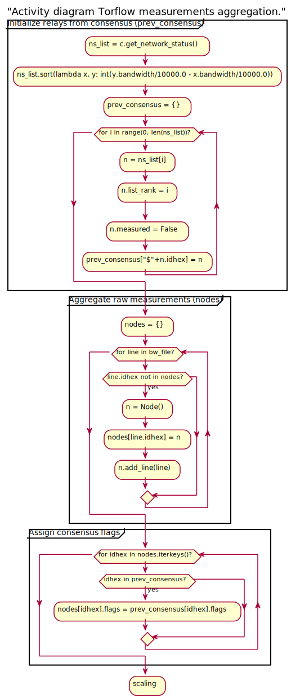
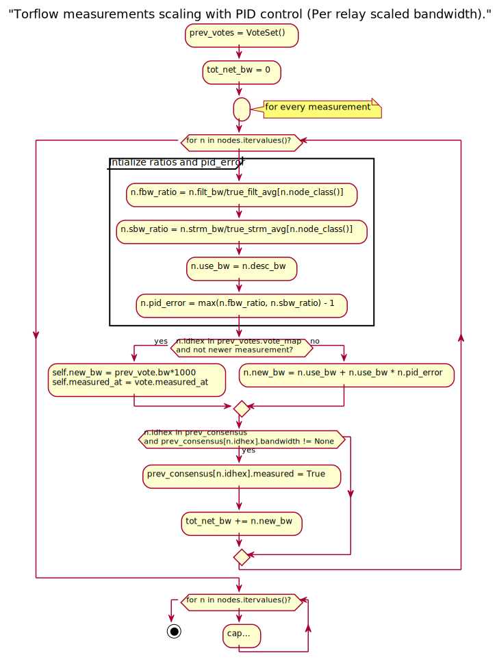
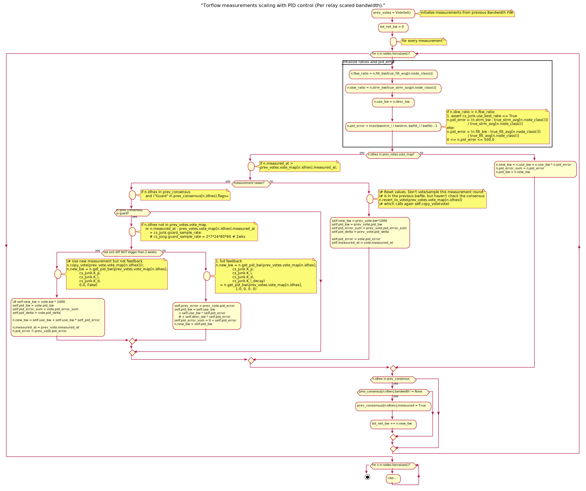
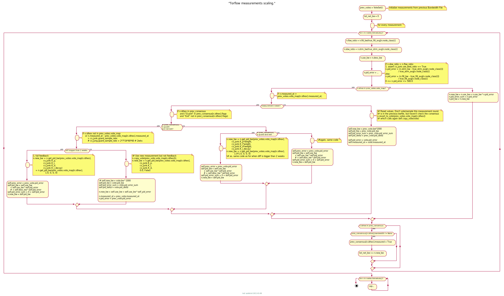

.. _torflow_aggr:

Torflow aggregation and scaling
===============================

.. seealso:: :ref:`generator` and :ref:`differences`.

Torflow aggregation or scaling goal is:

From Torflow's `README.spec.txt`_ (section 2.2)::

    In this way, the resulting network status consensus bandwidth values
    are effectively re-weighted proportional to how much faster the node
    was as compared to the rest of the network.

Initialization
--------------

Constants in consensus that Torflow uses and don't change::

  bandwidth-weights Wbd=0 Wbe=0 [] Wbm=10000 Wdb=10000 Web=10000 Wed=10000 Wee=10000 Weg=10000 Wem=10000 Wgb=10000 Wgd=0 Wgg=5852 [] Wmb=10000 Wmd=0 Wme=0 [] Wmm=10000

  params [] bwauthpid=1

Constants in the code::

  IGNORE_GUARD = 0
  GUARD_SAMPLE_RATE = 2*7*24*60*60 # 2wks
  MAX_AGE = 2*GUARD_SAMPLE_RATE;  # 4 weeks

  K_p = 1.0
  T_i = 0
  T_i_decay = 0
  T_d = 0

Initialization ``ConsensusJunk``::

  self.bwauth_pid_control = True
  self.group_by_class = False
  self.use_pid_tgt = False
  self.use_circ_fails = False
  self.use_best_ratio = True
  self.use_desc_bw = True
  self.use_mercy = False
  self.guard_sample_rate = GUARD_SAMPLE_RATE
  self.pid_max = 500.0
  self.K_p = K_p = 1.0
  self.T_i = T_i = 0
  self.T_d = T_d = 0
  self.T_i_decay = T_i_decay = 0

  self.K_i = 0
  self.K_d = self.K_p*self.T_d = 0

Initialization ``Node``::

    self.sbw_ratio = None
    self.fbw_ratio = None
    self.pid_bw = 0
    self.pid_error = 0
    self.prev_error = 0
    self.pid_error_sum = 0
    self.pid_delta = 0
    self.ratio = None
    self.new_bw = None
    self.use_bw = -1
    self.flags = ""

    # measurement vars from bwauth lines
    self.measured_at = 0
    self.strm_bw = 0
    self.filt_bw = 0
    self.ns_bw = 0
    self.desc_bw = 0
    self.circ_fail_rate = 0
    self.strm_fail_rate = 0
    self.updated_at = 0

.. _relay-descriptors-bandwidth:

Descriptor values for each relay
--------------------------------

From `TorCtl.py`_ code, it is the minimum of all the descriptor bandwidth
values::

    bws = map(int, g)
    bw_observed = min(bws)

    [snip]

    return Router(ns.idhex, ns.nickname, bw_observed, dead, exitpolicy,
    ns.flags, ip, version, os, uptime, published, contact, rate_limited,
    ns.orhash, ns.bandwidth, extra_info_digest, ns.unmeasured)

``ns.bandwidth`` is the consensus bandwidth, already multiplied by 1000::

  yield NetworkStatus(*(m.groups()+(flags,)+(int(w.group(1))*1000,))+(unmeasured,))

Because of the matched regular expression, ``bws`` is **not** all the descriptor
bandwidth values, but the average bandwidth and the observed bandwidth, ie., it
does not take the average burst, what seems to be a bug in Torflow.

Eg. ``bandwidth`` line in a descriptor::

  bandwidth 1536000 4096000 1728471

Only takes the first and last values, so::

  bw_observed = min(bandwidth-avg, bandwidth-observed)

This is passed to ``Router``, in which the descriptors bandwidth is assigned to
the consensus bandwidth when there is no consensus bandwidth::

    (idhex, name, bw, down, exitpolicy, flags, ip, version, os, uptime,
       published, contact, rate_limited, orhash,
       ns_bandwidth,extra_info_digest,unmeasured) = args

    [snip]

    if ns_bandwidth != None:
      self.bw = max(ns_bandwidth,1) # Avoid div by 0
    else:
      self.bw = max(bw,1) # Avoid div by 0

    [snip]

    self.desc_bw = max(bw,1) # Avoid div by 0

So::

  self.bw = ns_bwandwidth or min(bandwidth-avg, bandwidth-observed) or 1
  desc_bw = min(bandwidth-avg, bandwidth-observed) or 1

And written by `SQLSupport.py`_ as descriptor and conensus bandwidth::

      f.write(" desc_bw="+str(int(cvt(s.avg_desc_bw,0))))
      f.write(" ns_bw="+str(int(cvt(s.avg_bw,0)))+"\n")

.. _relay-descriptor-bandwidth-pid:

Descriptor bandwidth with PID control
~~~~~~~~~~~~~~~~~~~~~~~~~~~~~~~~~~~~~

Even though `README.spec.txt`_ talks about the consensus bandwidth, in
`aggregate.py`_ code, the consensus bandwidth is never used, since
``use_desc_bw`` is initialized to True and never changed::

    if cs_junk.bwauth_pid_control:
      if cs_junk.use_desc_bw:
        n.use_bw = n.desc_bw
      else:
        n.use_bw = n.ns_bw

So::

  n.use_bw = n.desc_bw = min(bandwidth-avg, bandwidth-observed) or 1

Scaling the raw measurements
----------------------------

.. _overview:

Overview
~~~~~~~~

This diagram also includes
:ref:`relay-descriptor-bandwidth-pid`,
:ref:`relay-bandwidth-ratio` and :ref:`relay-scaled-bandwidth-pid`.

Simplified image from:

`<./_images/activity_torflow_scaling_simplified.svg>`_

`<./_images/activity_torflow_scaling.svg>`_

Stream and filtered bandwidth for each relay
~~~~~~~~~~~~~~~~~~~~~~~~~~~~~~~~~~~~~~~~~~~~

They are calculated in the same way whether or not `PID controller`_ feedback
is used.

From Torflow's `README.spec.txt`_ (section 1.6)::

    The strm_bw field is the average (mean) of all the streams for the relay
    identified by the fingerprint field.

    The filt_bw field is computed similarly, but only the streams equal to
    or greater than the strm_bw are counted in order to filter very slow
    streams due to slow node pairings.

In the code, `SQLSupport.py`_, ``strm_bw`` is ``sbw`` and
``filt_bw`` is ``filt_sbws``::

      for s in rs.router.streams:
        if isinstance(s, ClosedStream):
          tot_bytes += s.tot_bytes()
          tot_duration += s.end_time - s.start_time
          tot_bw += s.bandwidth()
          s_cnt += 1
      # FIXME: Hrmm.. do we want to do weighted avg or pure avg here?
      # If files are all the same size, it shouldn't matter..
      if s_cnt > 0:
        rs.sbw = tot_bw/s_cnt
      else: rs.sbw = None

    for rs in RouterStats.query.filter(stats_clause).\
          options(eagerload_all('router.streams.circuit.routers')).all():
      tot_sbw = 0
      sbw_cnt = 0
      for s in rs.router.streams:
        if isinstance(s, ClosedStream):
          skip = False
          #for br in badrouters:
          #  if br != rs:
          #    if br.router in s.circuit.routers:
          #      skip = True
          if not skip:
            # Throw out outliers < mean
            # (too much variance for stddev to filter much)
            if rs.strm_closed == 1 or s.bandwidth() >= rs.sbw:
              tot_sbw += s.bandwidth()
              sbw_cnt += 1

    if sbw_cnt: rs.filt_sbw = tot_sbw/sbw_cnt
    else: rs.filt_sbw = None

When it is written to the file, it seem to write "None" string when
``filt_sbw`` or ``strm_bw`` are None. That would give an exception when
calculating the network average. So it never happen?::

    def cvt(a,b,c=1):
      if type(a) == float: return int(round(a/c,b))
      elif type(a) == int: return a
      elif type(a) == type(None): return "None"
      else: return type(a)

    f.write(" strm_bw="+str(cvt(s.sbw,0)))
    f.write(" filt_bw="+str(cvt(s.filt_sbw,0)))

This is also expressed in pseudocode in the `bandwidth file spec`_, section B.4
step 1.

Calling ``bwstrm_i`` to ``strm_bw`` and ``bwfilt_i`` to ``filt_bw``,
if ``bw_j`` is a measurement for a relay ``i``, then:::

  bwstrm_i = mean(bw_j)  # for a relay, the average of all its measurements
  bwfilt_i = mean(max(bwstrm_i, bw_j))

.. _stream-and-filtered-bandwidth-for-all-relays:

Stream and filtered bandwidth for all relays
~~~~~~~~~~~~~~~~~~~~~~~~~~~~~~~~~~~~~~~~~~~~

From `README.spec.txt`_ (section 2.1)::

    Once we have determined the most recent measurements for each node, we
    compute an average of the filt_bw fields over all nodes we have measured.

In Torflow's `aggregate.py`_ code::

  for cl in ["Guard+Exit", "Guard", "Exit", "Middle"]:
    c_nodes = filter(lambda n: n.node_class() == cl, nodes.itervalues())
    if len(c_nodes) > 0:
      true_filt_avg[cl] = sum(map(lambda n: n.filt_bw, c_nodes))/float(len(c_nodes))
      true_strm_avg[cl] = sum(map(lambda n: n.strm_bw, c_nodes))/float(len(c_nodes))
      true_circ_avg[cl] = sum(map(lambda n: (1.0-n.circ_fail_rate),
                            c_nodes))/float(len(c_nodes))

The following code seems to be used only to log::

    filt_avg = sum(map(lambda n: n.filt_bw, nodes.itervalues()))/float(len(nodes))
    strm_avg = sum(map(lambda n: n.strm_bw, nodes.itervalues()))/float(len(nodes))

So it seems the ``filt_avg`` and ``strm_avg`` are calculated by class in both
the cases with PID control and without PID control.

Calling ``bwstrm`` to ``strm_avg`` and ``bwfilt`` to ``fitl_avg``, without
taking into account the different types of nodes::

  bwstrm = mean(bwstrm_i)
  bwfilt = mean(bwfilt_i)

This is also expressed in pseudocode in the `bandwidth file spec`_, section B.4
step 2.

.. _relay-bandwidth-ratio:

Ratio for each relay
~~~~~~~~~~~~~~~~~~~~

From `README.spec.txt`_ (section 2.2)::

    These averages are used to produce ratios for each node by dividing the
    measured value for that node by the network average.

In Torflow's `aggregate.py`_ code::

    for n in nodes.itervalues():
        n.fbw_ratio = n.filt_bw/true_filt_avg[n.node_class()]
        n.sbw_ratio = n.strm_bw/true_strm_avg[n.node_class()]

    [snip]

    # Choose the larger between sbw and fbw
      if n.sbw_ratio > n.fbw_ratio:
        n.ratio = n.sbw_ratio
      else:
        n.ratio = n.fbw_ratio

So::

  n.ratio = max(sbw_ratio, n.fbw_ratio)

This is also expressed in pseudocode in the `bandwidth file spec`_, section B.4
step 2 and 3.

.. relay-scaled-no-pid:

Scaled bandwidth for each relay without PID control
~~~~~~~~~~~~~~~~~~~~~~~~~~~~~~~~~~~~~~~~~~~~~~~~~~~

From `README.spec.txt`_ (section 2.2)::

    These ratios are then multiplied by the most recent observed descriptor
    bandwidth we have available for each node, to produce a new value for
    the network status consensus process.

In `aggregate.py`_ code::

    n.new_bw = n.desc_bw*n.ratio

So::

    n.new_bw = (
        min(bandwidth-avg, bandwidth-observed) or 1 \
        * max(bwstrm_i / bwstrm, bwfilt_i / bwfilt_i)
    )

This is also expressed in pseudocode in the `bandwidth file spec`_, section B.4
step 5.

.. _relay-scaled-bandwidth-pid:

Scaled bandwidth for each relay with PID control
~~~~~~~~~~~~~~~~~~~~~~~~~~~~~~~~~~~~~~~~~~~~~~~~

From `README.spec.txt`_ section 3.1::

   The bandwidth authorities measure F_node: the filtered stream
   capacity through a given node (filtering is described in Section 1.6).

   [snip]

   pid_error = e(t) = (F_node - F_avg)/F_avg.

   [snip]

   new_consensus_bw = old_consensus_bw +
                        old_consensus_bw * K_p * e(t) +
                        old_consensus_bw * K_i * \integral{e(t)} +
                        old_consensus_bw * K_d * \derivative{e(t)}

   [snip]

   For the case where K_p = 1, K_i=0, and K_d=0, it can be seen that this
   system is equivalent to the one defined in 2.2, except using consensus
   bandwidth instead of descriptor bandwidth:

       new_bw = old_bw + old_bw*e(t)
       new_bw = old_bw + old_bw*(F_node/F_avg - 1)
       new_bw = old_bw*F_node/F_avg
       new_bw = old_bw*ratio

In Torflow's code, this is actually the case and most of the code is not
executed because the default ``K`` values.

It seems then that ``F_node`` is ``filt_bw`` in Torflow's code or ``bwfilt_i``
here, and ``F_avg`` is ``filt_avg`` in Torflow's code or ``bwfilt`` here.

In `aggregate.py`_ code, pid error also depends on which of the ratios is
greater::

    if cs_junk.use_best_ratio and n.sbw_ratio > n.fbw_ratio:
            n.pid_error = (n.strm_bw - true_strm_avg[n.node_class()]) \
                            / true_strm_avg[n.node_class()]
            else:
            n.pid_error = (n.filt_bw - true_filt_avg[n.node_class()]) \
                            / true_filt_avg[n.node_class()]

    [snip]

    n.new_bw = n.use_bw + cs_junk.K_p*n.use_bw*n.pid_error

So::

  if (bwstrm_i / bwstrm) > (bwfilt_i / bwfilt):
      pid_error = (bwstrm_i - bwstrm) / bwstrm = (bwstrm_i / bwstrm) - 1
  else:
      pid_error = (bwfilt_i - bwfilt_i) / bwfilt = (bwfilt_i / bwfilt) - 1

  new_bw = use_bw + use_bw * pid_error

Or::

  if (bwstrm_i / bwstrm) > (bwfilt_i / bwfilt):
      new_bw = use_bw + use_bw * ((bwstrm_i / bwstrm) - 1)
      new_bw = use_bw + use_bw * (bwstrm_i / bwstrm) - use_bw
      new_bw = use_bw * (bwstrm_i / bwstrm)
  else:
      new_bw = use_bw + use_bw * ((bwfilt_i / bwfilt) - 1)
      new_bw = use_bw + use_bw * (bwfilt_i / bwfilt) - use_bw
      new_bw = use_bw * (bwfilt_i / bwfilt)

Or::

  new_bw = use_bw * max(bwstrm_i / bwstrm, bwfilt_i / bwfilt)
  new_bw = (
      min(bandwidth-avg, bandwidth-observed) or 1
      * max(bwstrm_i / bwstrm, bwfilt_i / bwfilt)
  )

.. note::
    So, the new scaled bandwidth is the same for both cases with and without
    PID controller!

Other pid KeyValues in the Bandwidth File
-----------------------------------------

.. note::

  From the :ref:`overview` it seems that the only variable needed to
  calculate the new scaled bandwidth is the ``pid_error``, and from
  :ref:`relay-descriptor-bandwidth-pid`, it can be substituted
  by the stream and filtered bandwidths.

This are the variables that can then be ignored::

  pid_error_sum
  pid_delta
  prev_error

Limit scaled bandwidth for each relay
-------------------------------------

It's calculated the same with and without PID control

Once each relay bandwidth is scaled, it is limited to a maximum, that is
calculated as the sum of all the relays in the current consensus scaled
bandwidth per 0.05.

From `aggregate.py`_ code::

    NODE_CAP = 0.05

    [snip]

    if n.idhex in prev_consensus:
      if prev_consensus[n.idhex].bandwidth != None:
        prev_consensus[n.idhex].measured = True
        tot_net_bw += n.new_bw

    [snip]

    if n.new_bw > tot_net_bw*NODE_CAP:
      [snip]
      n.new_bw = int(tot_net_bw*NODE_CAP)

Round the scaled bandwidth for each relay
-----------------------------------------

Finally, the new scaled bandwidth is expressed in kilobytes and rounded a number
of digits.

.. _README.spec.txt: https://gitweb.torproject.org/torflow.git/tree/NetworkScanners/BwAuthority/README.spec.txt
.. _PID Controller: https://en.wikipedia.org/wiki/PID_controller
.. _SQLSupport.py: https://gitweb.torproject.org/pytorctl.git/tree/SQLSupport.py#n493
.. _bandwidth file spec: https://gitweb.torproject.org/torspec.git/tree/bandwidth-file-spec.txt
.. _aggregate.py: https://gitweb.torproject.org/torflow.git/tree/NetworkScanners/BwAuthority/aggregate.py
.. _TorCtl.py: https://gitweb.torproject.org/pytorctl.git/tree/TorCtl.py
